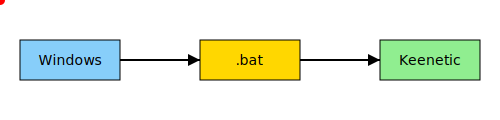

# Генератор маршрутов для Keenetic 🚧

Небольшое Flask-приложение, которое из доменных имён, IP-адресов или CIDR подсетей генерирует команды `route add` и сохраняет их в `.bat` файл. Эти файлы предназначены для загрузки новых маршрутов в таблицу маршрутизации роутеров **Keenetic**.



## Особенности

- 📋 Принимает строки с IP, сетями CIDR и доменами
- 🤖 Автоматически определяет IP доменов и CIDR через `whois`
- 📝 Формирует набор команд и сохраняет его в `.bat`
- 🚀 Полученный `.bat` можно загрузить в систему управления роутером Keenetic
- 📂 Сохраняет историю последних запросов (до 10)

## Установка

1. Склонируйте репозиторий:
   ```bash
   git clone <repo>
   ```
2. Установите зависимости:
   ```bash
   pip install -r req.txt
   ```
3. Запустите приложение:
   ```bash
   python3 main.py
   ```
4. Откройте в браузере [http://localhost:2022](http://localhost:2022).

## Пример

На вход можно передавать данные построчно, например:

```
8.8.8.8
google.com
1.1.1.0/24
```

После отправки появится таблица с IP, CIDR и готовыми командами, а также кнопка для скачивания `.bat` файла. Этот файл можно использовать для загрузки маршрутов в Keenetic.

## Системные требования

Необходимо наличие установленной утилиты `whois`, Python 3.9+ и интернет для определения CIDR доменов.

---

Создано просто для удобства, пользуйтесь на здоровье! ✨
